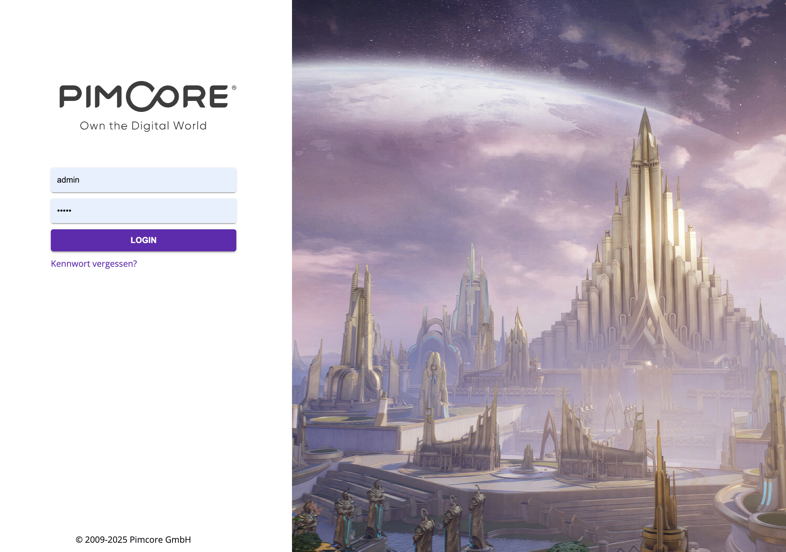

## Pimcore Materialised Bundle

### 🚀 Bringing Material Design to Pimcore!

The Pimcore Materialised Bundle is a sleek and modern UI enhancement plugin for Pimcore, providing Material Design-inspired styling across the Pimcore admin interface. Say goodbye to outdated UI elements and enjoy a visually refined experience that aligns with Google’s Material Design principles.

### How it works
This package basically provides a patch-css files for all classes provided by the `pimcore/admin-ui-classic-bundle` library 
### ✨ Features

* Material Design Aesthetics – Elevate Pimcore’s UI with smooth shadows, rounded edges, and improved spacing.
* Refined UI Components – Buttons, toolbars, Modals and Form elements now look polished and consistent.

### 📦 Installation

```bash
composer require lekoma/pimcore-materialised-bundle
```

Then, enable the bundle in Pimcore:

```php
<?php
// config/bundles.php
return [
    Pimcore\Bundle\MaterialisedBundle\PimcoreMaterialisedBundle::class => ['all' => true],
];
```

### 🎨 Screenshots



To See more just apply the lib to your pimcore-project - and enjoy ;-)

### 🤝 Contributing

We welcome contributions! Feel free to submit issues, feature requests, or pull requests.